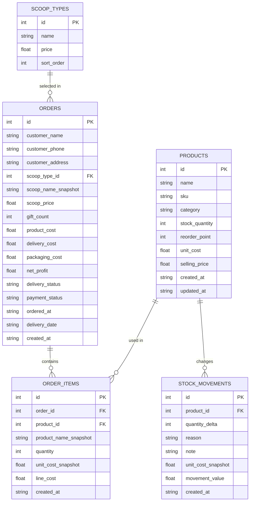

# Khaza-Scoop Page Logic And SQLite Model

This document explains:

1. Every page in the dashboard
2. The business logic behind each page
3. How data is stored in SQLite
4. How the pages connect to each other

## Product Summary

Khaza-Scoop is a mystery scoop order management dashboard.

The owner workflow is:

1. Add gift inventory with `cost price` and `quantity`
2. Set the selling price of each scoop type
3. Create an order with customer details
4. Select the scoop size
5. Select the gifts unlocked by the customer's bead result
6. Save the order
7. Automatically reduce stock
8. Calculate and store product cost and projected profit
9. Later add delivery and packaging cost
10. Recalculate final profit automatically

## Page List

- `/login`
- `/`
- `/stock`
- `/orders`
- `/expenses`
- `/query-tester`

## SQLite Database Diagram

## Important Schema Note

The `products` table still contains `sku`, `reorder_point`, and `selling_price` columns for backward compatibility with earlier data, but the current business flow does **not** depend on them.

The current live logic uses:

- `products.name`
- `products.category`
- `products.stock_quantity`
- `products.unit_cost`
- `scoop_types.price`
- `orders`
- `order_items`
- `stock_movements`

## Table Purpose

### `scoop_types`

Stores editable scoop selling prices.

Examples:

- Small
- Medium
- Large
- Custom

Used by:

- Stock page
- Orders page
- Dashboard
- Expenses page

### `products`

Stores all gift items that can be given after the scoop result is revealed.

Main business fields:

- `name`
- `category`
- `stock_quantity`
- `unit_cost`

Used by:

- Stock page
- Orders page
- Dashboard low-stock logic
- Expenses analytics through order snapshots

### `stock_movements`

Stores every stock change.

Examples:

- Initial stock added
- Refill from supplier
- Manual correction
- Order allocation

This is the audit trail for inventory.

### `orders`

Stores the master record for each customer order.

Main business fields:

- Customer details
- Selected scoop
- Scoop price snapshot
- Total product cost snapshot
- Delivery cost
- Packaging cost
- Saved profit
- Delivery status
- Payment status

### `order_items`

Stores the checklist of gifts selected for each order.

This is what connects a scoop order to the actual gifts given.

Each row stores:

- Which order it belongs to
- Which product was used
- Quantity used
- Cost snapshot at order time
- Line cost

## Page Business Logic

## 1. Login Page

Route: `/login`

### Purpose

Lets the owner enter the dashboard.

### Inputs

- Email
- Password

### Logic

- Validates against local configured credentials
- Creates a session cookie
- Redirects the owner to the dashboard

### Output

- Successful login moves user to `/`
- Invalid login stays on the page with an error state

### Database impact

- None

## 2. Dashboard Page

Route: `/`

### Purpose

Shows the business snapshot at a glance.

### What it displays

- Cash in
- Cash out
- Cash left
- Pending cash
- Gross sales
- Product cost used
- Order contribution profit
- Final business profit
- Inventory purchases
- Inventory used
- Inventory left value
- Low stock items
- Pending orders
- Delivering orders
- Business expense split
- Recent expenses
- Recent stock refills
- Recent scoop orders

### Cash flow logic

`Cash In = SUM(orders.scoop_price WHERE payment_status = 'paid')`

`Cash Out = SUM(expenses.amount)`

`Cash Left = Cash In - Cash Out`

`Pending Cash = SUM(orders.scoop_price WHERE payment_status != 'paid')`

### Profit logic

`Gross Sales = Cash In`

`Product Cost Used = SUM(orders.product_cost WHERE payment_status = 'paid')`

`Delivery Cost Used = SUM(orders.delivery_cost WHERE payment_status = 'paid')`

`Packaging Cost Used = SUM(orders.packaging_cost WHERE payment_status = 'paid')`

`Order Contribution Profit = SUM(orders.net_profit WHERE payment_status = 'paid')`

`Final Business Profit = Order Contribution Profit - Meta Ads - Packaging Purchase - Misc`

### Inventory logic

`Inventory Purchases = SUM(expenses.amount WHERE category = 'INVENTORY_PURCHASE')`

`Inventory Used = SUM(orders.product_cost)`

`Inventory Left Value = SUM(products.stock_quantity * products.unit_cost)`

### Low stock logic

An item is treated as low stock when:

`products.stock_quantity <= 5`

### Database sources

- `orders`
- `order_items`
- `products`
- `stock_movements`

## 3. Stock Page

Route: `/stock`

### Purpose

This page manages:

- Gift inventory
- Refill quantity changes
- Scoop prices

### Section A: Add Inventory Item

#### Inputs

- Product name
- Cost price
- Opening quantity
- Category

#### Logic

- Creates a product row
- Generates an internal unique SKU automatically
- Saves the current unit cost
- Saves opening stock
- If opening quantity is greater than zero, also writes a stock movement

#### Database writes

- `products`
- `stock_movements`

### Section B: Scoop Pricing

#### Inputs

- Price for each scoop type

Examples:

- Small
- Medium
- Large
- Custom

#### Logic

- Updates the price in `scoop_types`
- Orders later use this value as the selling price snapshot

#### Database writes

- `scoop_types`

### Section C: Update Item Quantity

#### Inputs

- Item
- Quantity change
- Optional updated cost price
- Reason
- Optional note

#### Logic

- Positive quantity adds stock
- Negative quantity reduces stock
- Prevents stock from going below zero
- Saves cost snapshot for that movement
- Saves movement value as `abs(quantity_change) * unit_cost`
- Updates product quantity
- Updates latest unit cost if entered
- Does not change cash-out reporting by itself
- Refill money should also be logged on `/expenses` as `Inventory Purchase`

#### Database writes

- `products`
- `stock_movements`

### Section D: Current Inventory

#### Shows

- Product
- Category
- Quantity
- Cost
- Stock value

#### Stock value logic

`Stock Value = unit_cost * stock_quantity`

## 4. Orders Page

Route: `/orders`

### Purpose

This is the core business page.

It handles:

- Customer data
- Scoop selection
- Gift selection
- Inventory deduction
- Profit snapshot creation
- Later delivery and packaging cost updates

### Order Creation Flow

#### Step 1: Capture customer details

Inputs:

- Customer name
- Phone
- Address

#### Step 2: Select scoop

Input:

- One scoop type from `scoop_types`

Logic:

- Pull current scoop price from database
- Use that as order revenue snapshot

#### Step 3: Select gifts

Inputs:

- Checklist of products
- Quantity per selected product

Logic:

- User selects the gifts unlocked by the bead result
- Each selected product becomes an `order_items` row

#### Step 4: Calculate gift cost

For each selected item:

`Line Cost = product.unit_cost * selected_quantity`

Then:

`Product Cost = SUM(all line costs)`

#### Step 5: Calculate projected profit

Before delivery and packaging are filled:

`Projected Profit = scoop_price - product_cost`

#### Step 6: Save order

When saved:

- Create `orders` row
- Create `order_items` rows
- Reduce product stock
- Save stock movement rows with negative quantity
- Save scoop price snapshot
- Save product cost snapshot
- Save `net_profit`

### Order Update Flow

Later the owner can update:

- Delivery status
- Payment status
- Delivery date
- Delivery cost
- Packaging cost

### Final profit logic

`Order Contribution Profit = scoop_price - product_cost - delivery_cost - packaging_cost`

If delivery or packaging cost is still empty, the system treats missing values as zero for calculation.

### Order tracker table shows

- Customer name
- Phone
- Scoop type
- Selected gifts summary
- Scoop revenue
- Product cost
- Total expense
- Order contribution profit
- Delivery status
- Payment status
- Delivery and packaging inputs

### Database writes

- `orders`
- `order_items`
- `products`
- `stock_movements`

## 5. Expenses Page

Route: `/expenses`

### Purpose

Tracks manual business expenses and explains how those expenses affect cash flow and final business profit.

### What it displays

- Expense entry form
- Cash in
- Cash out
- Cash left
- Pending cash
- Gross sales
- Gift cost
- Delivery cost
- Packaging cost
- Order contribution profit
- Business expense analysis
- Final business profit
- Recent expenses
- Recent order profit snapshots

### Cost logic

#### Cash in

`SUM(orders.scoop_price WHERE payment_status = 'paid')`

#### Cash out

`SUM(expenses.amount)`

#### Gift cost

`SUM(orders.product_cost WHERE payment_status = 'paid')`

#### Delivery cost

`SUM(orders.delivery_cost WHERE payment_status = 'paid')`

#### Packaging cost

`SUM(orders.packaging_cost WHERE payment_status = 'paid')`

#### Order contribution profit

`Gross Sales - Gift Cost - Delivery Cost - Packaging Cost`

#### Final business profit

`Order Contribution Profit - Meta Ads - Packaging Purchase - Misc`

### Manual expense categories

- `INVENTORY_PURCHASE`
- `META_ADS`
- `PACKAGING_PURCHASE`
- `MISC`

### Why this page matters

It gives the owner answers to:

- How much paid cash came in from scoops?
- How much manual cash went out?
- How much order contribution profit has been generated?
- How much of that profit is left after ads, packaging purchases, and misc spending?
- How much money was spent on inventory buying?

### Database sources

- `orders`
- `expenses`
- `products`

## 6. Query Tester Page

Route: `/query-tester`

### Purpose

A local admin/debugging tool for direct SQLite access.

### What it does

- Runs `SELECT`
- Runs `INSERT`
- Runs `UPDATE`
- Runs `DELETE`
- Runs SQL scripts such as schema inspection or manual fixes

### Important rule

This page is for trusted local use only because it can bypass normal app flows.

### Database impact

- Directly depends on the SQL entered by the owner

## Cross-Page Business Logic

## Inventory Logic

Inventory starts on the Stock page.

When an order is created:

1. The owner selects the actual gifts given
2. The app checks stock availability
3. Stock is reduced immediately
4. The reduction is saved to `stock_movements`

This means stock is fully connected between:

- Stock page
- Orders page
- Dashboard
- Expenses page

## Scoop Pricing Logic

Scoop prices are managed only from the Stock page.

When an order is created:

- The current scoop price is copied into the order as a snapshot

This is important because:

- Future scoop price changes should not change older order revenue

## Profit Logic

### At order creation time

`Projected Profit = scoop_price - product_cost`

### After delivery and packaging are filled

`Final Profit = scoop_price - product_cost - delivery_cost - packaging_cost`

The final saved value is written to:

- `orders.net_profit`

## Stock Refill Logic

Stock refill is both:

- An inventory update
- A cost signal

Each refill stores:

- Quantity change
- Cost price snapshot
- Movement value

This helps the owner understand the value of stock added over time.

## Example Business Flow

### Example

1. Owner adds inventory item:
   `Hair Clip` cost `10`, quantity `12`
2. Owner sets scoop price:
   `Medium` = `299`
3. Customer order is created:
   `Riya`, phone, address
4. Customer selected `Medium` scoop
5. Bead result maps to gifts:
   `Hair Clip x1`, `Bracelet x2`, `Nails x1`
6. Product cost is calculated:
   `10 + 0 + 60 = 70`
7. Projected profit at save:
   `299 - 70 = 229`
8. Stock reduces automatically
9. Later owner adds:
   delivery `55`, packaging `12`
10. Final profit becomes:
   `299 - 70 - 55 - 12 = 162`

## Main Rules Summary

- Stock is always saved with cost and quantity
- Scoop price is editable separately from products
- Orders are scoop-based, not product-selling-price-based
- One order can contain multiple gift items
- Product stock is reduced automatically on save
- Product cost is snapshotted at order time
- Delivery and packaging cost can be filled later
- Profit is saved and recalculated in the database
- Dashboard and Expenses both read connected live business data
